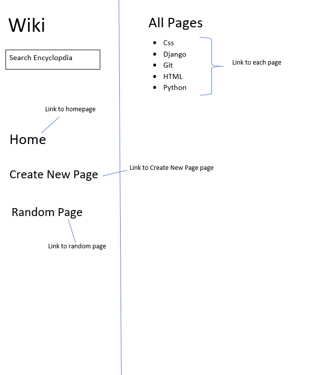
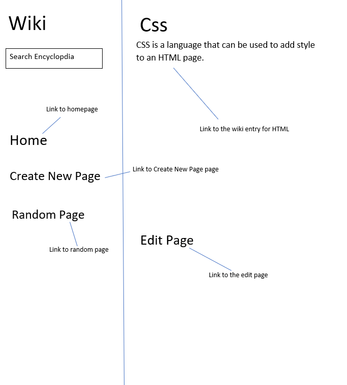
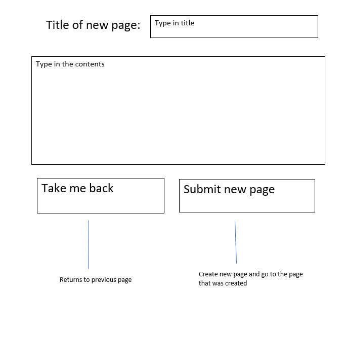
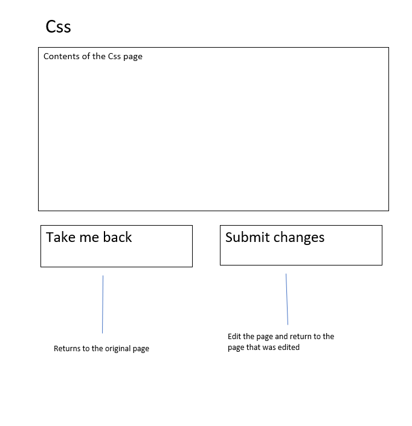

# Name & Description

Wiki is a website encyclopdia similar to wikipedia that starts of with a couple of default pages and allows users to add more pages.
it is possible to search for a specific page that the user wants or go to a random page.
The user is also able to edit the contents of the wikipage.

## Design

Most of the design can be borrowed from the starting website.
For the homepage or indexpage most of the design can stay the same.
The changes would be:
- The pages under All pages would now be links that each respective page
- Making the Home, Create New Page and Random page larger to make it easier to spot for users that these options are available
- Creating more space at the bottom of the search bar, so potential searches do not obscure the Home and Random page options

### Homepage design
The design for the indexpage would look something like this:

### Wiki Entry design
The pages of the wiki entries will be simple with a header at the top and under the header the contents of the page:

### New Page design
When the user clicks on the new page link they will go the New Page page:

### Edit Page design
When the user clicks edit page at the bottom of a wiki entry they will be directed towards the edit page for that wiki:

